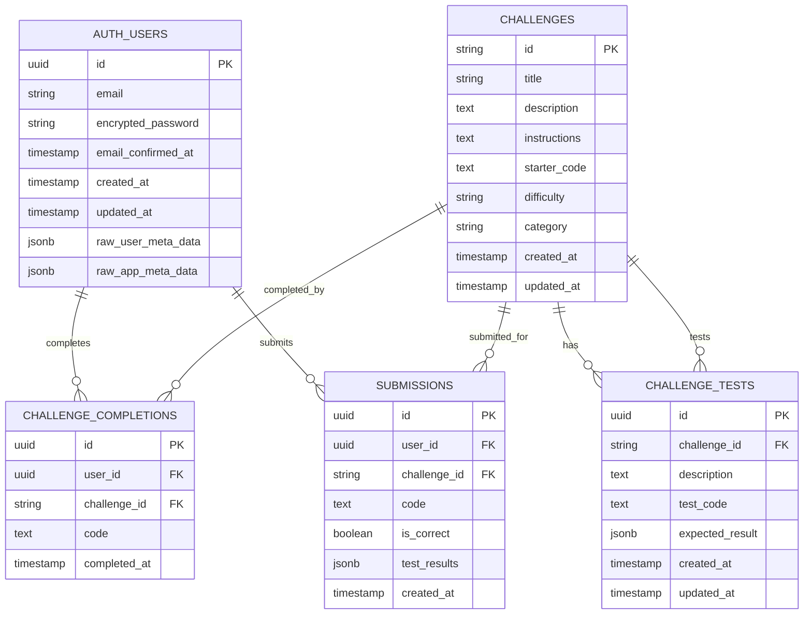

# DoLearner Database Schema

This diagram shows the current database structure for the DoLearner platform after the authentication flow improvements.

## Table Descriptions

### 🔐 **auth.users** (Supabase Auth)
- **Purpose**: Stores user authentication data
- **Managed by**: Supabase Auth system
- **Key Fields**:
  - `id`: Unique user identifier (UUID)
  - `email`: User's email address
  - `created_at`: Account creation timestamp

### 🎯 **challenges**
- **Purpose**: Stores all coding challenges
- **Key Fields**:
  - `id`: Unique challenge identifier (string)
  - `title`: Challenge display name
  - `description`: Challenge overview
  - `instructions`: Detailed requirements
  - `starter_code`: Initial code template
  - `difficulty`: Easy, Medium, Hard
  - `category`: React, CSS, JavaScript, etc.

### 🧪 **challenge_tests**
- **Purpose**: Stores test cases for each challenge
- **Key Fields**:
  - `challenge_id`: Links to challenges table
  - `description`: What the test checks
  - `test_code`: JavaScript test code
  - `expected_result`: Expected test outcome

### ✅ **challenge_completions**
- **Purpose**: Tracks successfully completed challenges
- **Key Fields**:
  - `user_id`: Links to auth.users
  - `challenge_id`: Links to challenges
  - `code`: User's final solution
  - `completed_at`: Completion timestamp

### 📝 **submissions**
- **Purpose**: Records all code submissions (correct and incorrect)
- **Key Fields**:
  - `user_id`: Links to auth.users
  - `challenge_id`: Links to challenges
  - `code`: Submitted code
  - `is_correct`: Whether all tests passed
  - `test_results`: Detailed test outcomes

## Key Design Decisions

### ✅ **Single Source of Truth**
- User data lives only in `auth.users`
- No redundant user tables
- All foreign keys point directly to `auth.users`

### 🔗 **Proper Relationships**
- `challenge_completions.user_id` → `auth.users.id`
- `submissions.user_id` → `auth.users.id`
- `challenge_tests.challenge_id` → `challenges.id`

### 🛡️ **Data Integrity & Security**
- Foreign key constraints ensure referential integrity
- CASCADE deletes clean up related data when users are deleted
- UUID primary keys for security and scalability
- **Row Level Security (RLS)** enabled on sensitive tables
- **RLS Policies**:
  - Users can only view their own completions and submissions
  - Server-side API can insert for any valid auth user
  - Prevents unauthorized data access

### 📊 **Separation of Concerns**
- **challenges**: Static challenge data
- **challenge_tests**: Dynamic test cases (manageable via admin)
- **submissions**: All attempts (for analytics)
- **challenge_completions**: Only successful completions (for progress tracking)
